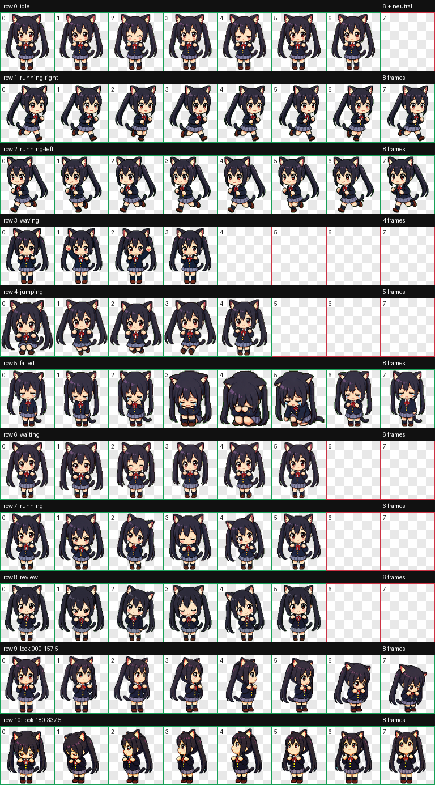
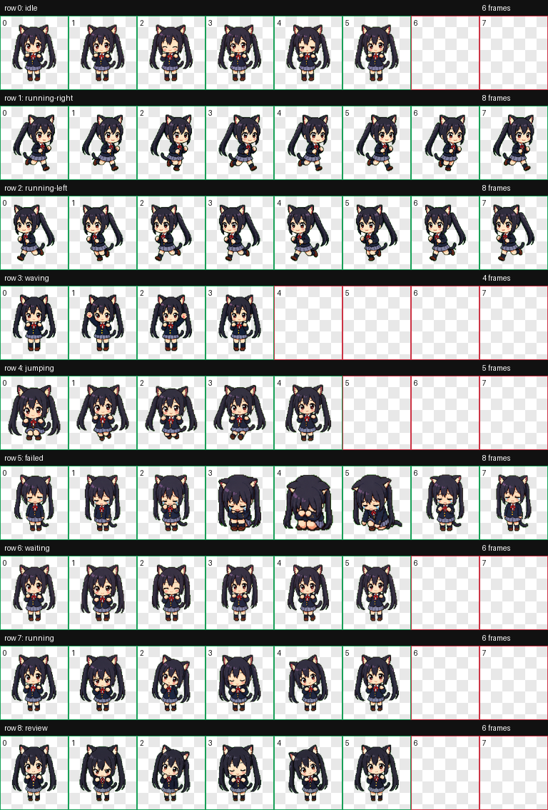
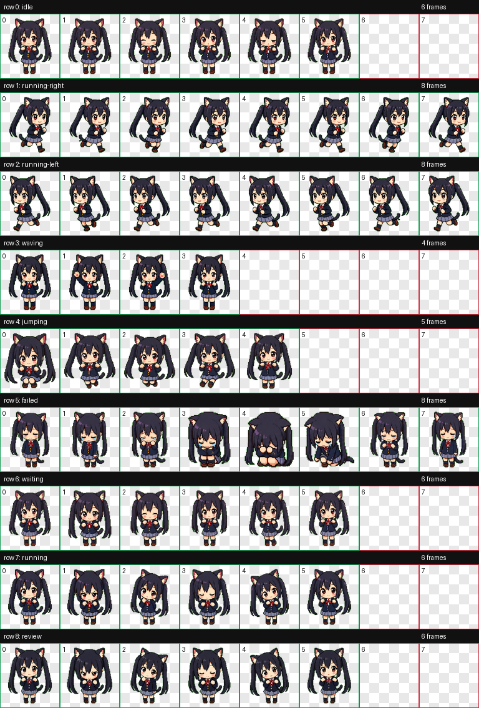
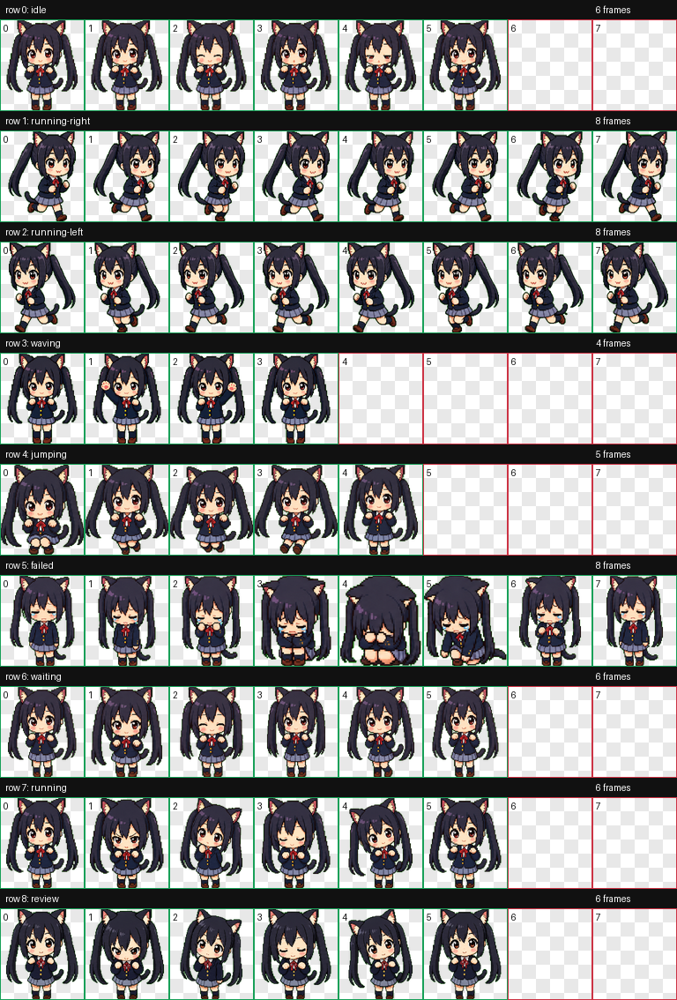

# Azunyan Codex Pet

Azunyan is a custom Codex pet packaged for the Codex app.

## Preview



## Size Previews

| 80% | 90% | 105% |
| --- | --- | --- |
|  |  |  |

## Files

- `pet.json` - Codex pet manifest
- `spritesheet.webp` - animated pet spritesheet
- `preview/contact-sheet.png` - QA contact sheet preview
- `variants/` - alternate scale packages

## Install

Install all sizes with one command:

```bash
curl -fsSL https://raw.githubusercontent.com/ThomasZB/codex-pets-azunyan/main/install.sh | sh
```

Install one size:

```bash
curl -fsSL https://raw.githubusercontent.com/ThomasZB/codex-pets-azunyan/main/install.sh | sh -s -- azunyan-90
```

Restart Codex if the pet does not appear immediately.

## Scale Variants

Codex pet atlases should stay `1536x1872` with `192x208` cells. Do not resize
the whole spritesheet image directly, because Codex slices the atlas by fixed
cell geometry. The scale variants keep the atlas dimensions fixed and resize the
pet inside each cell.

Available variants:

- `variants/azunyan-80` - 80% scale
- `variants/azunyan-90` - 90% scale
- `variants/azunyan-105` - 105% scale

Install a variant the same way:

```bash
curl -fsSL https://raw.githubusercontent.com/ThomasZB/codex-pets-azunyan/main/install.sh | sh -s -- azunyan-90
```
